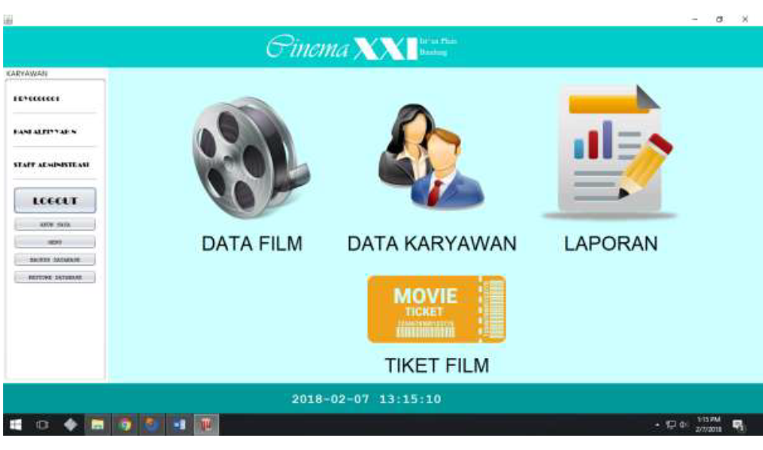

# Cinema Ticket Application

- - - -

## Features:

1. Login Application for 2 users (Administration Staff & Cashier)
2. Change Username and Password.
3. Backup & Restore the Entire Database, and the Film, Genre, Employee, Report Database.
4. Employee Data Management (Add New Data, View Descriptions, Edit, Delete)
5. Fire & Rehir Employees.
6.Movie Data Management (Add, View Description, Edit, Delete)
7. Managing Show Schedule (Add, Edit, Delete)
8. Management of Ticket Sales Data (Choose Movies, Choose Schedules, Select Seats, Pay)
9. Transaction Reports (View, Delete)
10. Print Transaction Reports
11. Print Tickets
12. Save the Transaction Report in .pdf Format
13. Search (Movies, Showtimes, Employees, Reports)